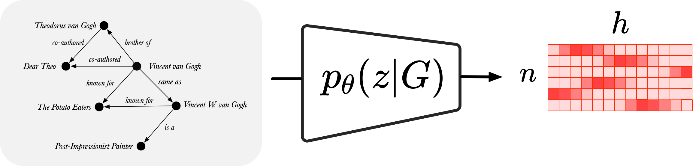

# Torch RGCN 

Relational Graph Convolutional Network embeds graphs, such as a Knowledge Graph, into a latent space
by passing messages along different relations.



This is a PyTorch implementation of the RGCN, originally proposed by Schlichtkrull *et al.* in  
[Modeling Relational Data with Graph Convolutional Networks](https://arxiv.org/abs/1703.06103).
 
In our workshop paper, we reproduce the relation prediction  and node classification experiments from the original 
paper and furthermore, present three RGCN extensions that address the shortcomings of the original RGCN.
 
Our workshop paper: [#TODO: Upload paper to Arxiv]

## Getting started

Requirements: 
* Conda >= 4.8
* Python >= 3.7

To download all datasets, use: `bash get_data.sh`

To install the necessary packages, use: `bash setup_dependencies.sh`

Now, you can install the RGCN module with: `pip install -e .`  

(Note: You may need to manually activate the virtual environment using `conda activate torch_rgcn_venv`)

## Usage

### Configuration files

The hyper-parameters for the different experiments can be found in [YAML](https://yaml.org/) files under 
[configs](configs). The naming convention of the files is as follows: `configs/{MODEL}/{EXPERIMENT}-{DATASET}.yaml`

### Models
* `rgcn` - Standard RGCN Model 
* `c-rgcn` - Compression RGCN Model 
* `e-rgcn` - Embedding RGCN Model
* `g-rgcn` - Global Readout RGCN Model

### Experiments
* `rp` - Relation Prediction
* `nc` - Node Classification 

### Datasets

#### Relation Prediction 

 * `AIFB` from 
 Stephan Bloehdorn and York Sure. 
 *[Kernel methods for mining instance data in ontologies.](https://link.springer.com/content/pdf/10.1007%2F978-3-540-76298-0_5.pdf).* 
 In The Semantic Web, 6th International Semantic Web Conference,  2007. 
 * `MUTAG` from 
 A. K. Debnath, R. L. Lopez de Compadre, G. Debnath, A. J.Shusterman, and C. Hansch. 
 *[Structure-activity relationship of mutagenic aromatic and heteroaromatic nitro-compounds correlation 
 with molecular orbital energies and hydrophobicity](https://pubs.acs.org/doi/pdf/10.1021/jm00106a046?casa_token=ECo0FUp3gNoAAAAA:6Xgkt3vGuQeVFnGwlPlyDWm-fIflRmsRe7s5X_SH143O4-wVz5eIMHj_cmDvBWCVon6LLvVt0nTgy-4).* 
 J Med Chem,34:786–797, 1991.
 * `BGS` from 
 de Vries, G.K.D.
 *[A fast approximation of the Weisfeiler-Lehman graph kernel for RDF data](https://link.springer.com/content/pdf/10.1007%2F978-3-642-40988-2_39.pdf).* 
 In European Conference on Machine Learning and Principles and Practice of Knowledge Discovery in Databases, 2013.
 * `AM` from 
de Boer, V., Wielemaker, J., van Gent, J., Hildebrand, M., Isaac, A., van Ossen-bruggen, J., Schreiber, G.
*[Supporting linked data production for cultural heritageinstitutes: The amsterdam museum case study](https://link.springer.com/content/pdf/10.1007%2F978-3-642-30284-8_56.pdf).* 
In The Semantic Web: Research and Applications, 2012.

#### Node Classification
 
 * `WN18` from 
 Antoine Bordes, Nicolas Usunier, Alberto Garcia-Duran , Jason Weston, and Oksana Yakhnenko. 
 *[Translating embeddings for modeling multi-relational data](http://papers.nips.cc/paper/5071-translating-embeddings-for-modeling-multi-rela)*.
 In Advances in Neural Information Processing Systems, 2013.
 * `WN18RR` from 
 Tim  Dettmers,  Pasquale  Minervini,  Pontus  Stenetorp,  and  Sebastian  Riedel. 
 *[Convolutional  2D knowledge graph embeddings](https://arxiv.org/abs/1707.01476).*
 In Proceedings of the Thirty-Second AAAI Conference on Artificial Intelligence (AAAI), 2018. 
 * `FB15K` from 
 Antoine Bordes, Nicolas Usunier, Alberto Garcia-Duran , Jason Weston, and Oksana Yakhnenko. 
 *[Translating embeddings for modeling multi-relational data](http://papers.nips.cc/paper/5071-translating-embeddings-for-modeling-multi-rela).*
 In Advances in Neural Information Processing Systems, 2013.** 
 * `FB15K-237` from 
 Kristina Toutanova and Danqi Chen.
 *[Observed versus latent features for knowledge base and text inference](https://www.aclweb.org/anthology/W15-4007.pdf).*
 In Proceedings of the 3rd Workshop on Continuous Vector Space Models and their Compositionality (CVSC@ACL), 2015.

## Part 1: Experiment Reproduction  

### Relation Prediction 

Original Relation Prediction Implementation: https://github.com/MichSchli/RelationPrediction 

To run the relation prediction experiment using the RGCN model using:

`python experiments/predict_links.py with configs/rgcn/rp-{DATASET}.yaml`

Make sure to replace `{DATASET}` with one of the following dataset names: `FB15k`, `FB15k-237`, `WN18` or `WN18RR`.

### Node Classification

Original Node Classification Implementation: https://github.com/tkipf/relational-gcn

To run the node classification experiment using the RGCN model using:

`python experiments/classify_nodes.py with configs/rgcn/nc-{DATASET}.yaml`

Make sure to replace `{DATASET}` with one of the following dataset names: `AIFB`, `MUTAG`, `BGS` or `AM`.

## Part 2: New Configurations 

### RGCN with Node Embeddings 

To run the node classification experiment use: 

`python experiments/classify_nodes.py with configs/e-rgcn/rp-{DATASET}.yaml`

Make sure to replace `{DATASET}` with one of the following dataset names: `AIFB`, `MUTAG`, `BGS` or `AM`.

### RGCN with Compressed Feature Matrix 

To run the relation prediction experiment use: 

`python experiments/predict_links.py with configs/c-rgcn/rp-{DATASET}.yaml`

Make sure to replace `{DATASET}` with one of the following dataset names: `FB15k`, `FB15k-237`, `WN18` or `WN18RR`.

### RGCN with Global Readouts

To run the node classification experiment use:

`python experiments/classify_nodes.py with configs/g-rgcn/rp-{DATASET}.yaml`

Make sure to replace `{DATASET}` with one of the following dataset names: `AIFB`, `MUTAG`, `BGS` or `AM`.


## Model Performance

### Part 1: Reproduction Experiments

#### Relation Prediction  using standard RGCN

| Dataset                       | Mean Reciprocal Rank (filtered)  | Hits@1 (filtered)      | Hits@3 (filtered)       | Hits@10 (filtered)      |
| ----------------------------- |:--------------------------------:|:----------------------:|:-----------------------:|:-----------------------:|
| FB15k                         | -                                | -                      | -                       | -                       |
| FB15k-237                     | -                                | -                      | -                       | -                       |
| WN18                          | -                                | -                      | -                       | -                       |
| WN18RR                        | -                                | -                      | -                       | -                       |

#### Node Classification using standard RGCN

| Dataset                       | Accuracy                         |
| ----------------------------- |:--------------------------------:|
| AIFB                          | -                                |
| AM                            | -                                |
| BGS                           | -                                |
| MUTAG                         | -                                |

### Part 2: New Configurations

#### Node Classification using e-RGCN

| Dataset                       | Accuracy                         |
| ----------------------------- |:--------------------------------:|
| AIFB                          | -                                |
| AM                            | -                                |
| BGS                           | -                                |
| MUTAG                         | -                                |

#### Relation Prediction using c-RGCN

| Dataset                       | Mean Reciprocal Rank (filtered)  | Hits@1 (filtered)      | Hits@3 (filtered)       | Hits@10 (filtered)      |
| ----------------------------- |:--------------------------------:|:----------------------:|:-----------------------:|:-----------------------:|
| FB15k                         | -                                | -                      | -                       | -                       |
| FB15k-237                     | -                                | -                      | -                       | -                       |
| WN18                          | -                                | -                      | -                       | -                       |
| WN18RR                        | -                                | -                      | -                       | -                       |

#### Node Classification using g-RGCN

| Dataset                       | Accuracy                         |
| ----------------------------- |:--------------------------------:|
| AIFB                          | -                                |
| AM                            | -                                |
| BGS                           | -                                |
| MUTAG                         | -                                |


## Unit Tests 

To run all unit tests use:
 
`pytest tests/test_nn.py`

To run unit tests for neural network util function use:

`pytest tests/test_nn.py`

To run unit tests for utils functions use:

`pytest tests/test_utils.py`

To run unit tests for misc functions use:

`pytest tests/test_misc.py`

## Citing Our Code 

If you use our implementation in your own work, you may cite our paper as

```
[ #TODO: INSERT PAPER BIBTEX CITATION ]
```
